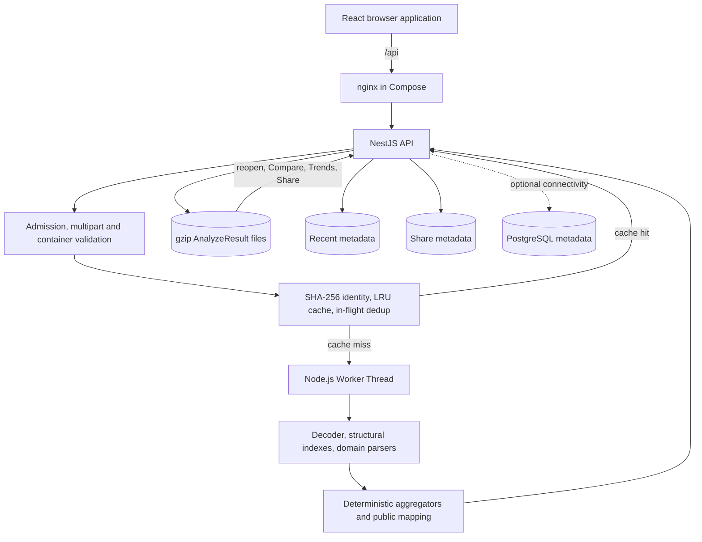

# Architecture

This document describes the implemented boundaries of HOI4 Save Tracker. It intentionally distinguishes local product hardening from a multi-tenant production security model.

## System overview

In native development, Vite replaces nginx and proxies `/api` to NestJS.

## Frontend responsibilities

The React application owns:

- file selection and sequential browser hashing for Campaign Import preflight;
- request progress, safe error taxonomy, cancellation, and recovery UX;
- analyzer navigation and country/detail selection state;
- rendering of backend summaries without parsing save text;
- Base/Target selection for Compare;
- trend chart presentation, normalization, and moving-average presentation;
- deterministic CSV/JSON download from already loaded DTOs;
- document-style reports and browser print;
- accessible confirmation for destructive local-storage actions.

The browser does not calculate backend industry, casualty, naval, division, stockpile, or production semantics.

## Backend responsibilities

NestJS owns:

- local-save path confinement and read-only listing;
- pre-multipart request admission and bounded temporary upload lifecycle;
- plain/ZIP validation, actual decompressed-byte bounds, and safe errors;
- content hashing, completed-result cache, and in-flight deduplication;
- Worker lifecycle and concurrency limits;
- durable result, Recent, and share persistence;
- compact Compare, Campaign Trends, and storage-management DTOs;
- exact campaign grouping by persisted `game_unique_id` context.

## Worker and parser boundary

The main process sends a file path and an explicit upload policy to a Worker. The Worker validates/decodes the save and invokes `analyzeSave()`. Success returns the public `AnalyzeResult` and normalized comparison context. Errors cross the boundary as sanitized structured messages.

The Worker is terminated before its slot and temporary input are released. Result, error, exit, timeout, and shutdown paths converge on one settlement path to avoid double completion.

Inside the parser, the decoded save text and analysis-scoped structural indexes are shared across domain parsers. Domain modules preserve raw unknown/modded identifiers and add only evidence-backed derivations. Aggregators and public mapping remove parser-only offsets/indexes before serialization.

## Identity, cache, and batch behavior

SHA-256 is calculated over the original save-file bytes and is the authoritative analysis identity.

- The completed in-memory cache is bounded and process-local.
- Concurrent requests for the same hash share one in-flight analysis.
- Durable existence, not RAM cache state, drives Campaign Import preflight.
- The browser submits new batch files one at a time through the normal hardened endpoint and retries bounded busy responses.
- Every successful batch item is persisted before it is reported complete.

No original-save path or filename is used as identity.

## Persistence model

Three local stores are intentionally separate:

1. **Result artifacts** — versioned gzip envelopes keyed by SHA-256. They contain derived `AnalyzeResult` data and comparison context.
2. **Recent metadata** — compact JSON records for display, retention, availability, pin state, and campaign/player context.
3. **Share metadata** — opaque public ID, result hash, and creation time.

Writes are serialized within one process and use an exclusive temporary file, fsync, close, and atomic rename. Startup/read reconciliation handles recognized stale artifacts and legacy metadata conservatively.

Storage status lists recognized gzip files and sums filesystem sizes. It does not decompress results. Bulk cleanup updates metadata and artifacts through the same serialized mutation queue. Pins are excluded from unpinned cleanup; campaign deletion requires explicit acknowledgement when pins are included. Active shares protect results during ordinary deletion/retention, while the hard byte ceiling remains authoritative.

Original uploaded `.hoi4` files are managed temporary inputs and are not retained in these stores. The Compose `/app/saves` read-only mount is a separate source directory.

PostgreSQL is an additional, optional metadata foundation. In Phase 1 it contains only versioned `users` and `sessions` schema for future authentication work. It does not contain AnalyzeResult data, artifact blobs, Recent metadata, Shares, projections, or parser caches. Database mode is disabled by default outside Compose; enabled startup validates connectivity but ordinary application startup never applies migrations.

## Campaign identity and downstream views

`game_unique_id` from persisted comparison context is the authoritative campaign key.

- Known equal IDs group into one campaign.
- Known different IDs are incompatible.
- Missing legacy identity remains unknown; no filename/date/country heuristic fills it.

Compare reads two persisted results and calculates finite-number deltas as Target − Base. An absent country or field remains unavailable. Campaign Trends reads all available persisted results, builds compact snapshots, and sorts them chronologically with deterministic tie-breakers. Reports and exports consume the same loaded result/DTO; they do not invoke the parser.

## Share links

Creating a share maps one persisted hash to a random 128-bit URL-safe ID. The public endpoint resolves only that ID and returns the persisted analysis. It does not expose a listing, original save, private filename, internal hash, filesystem path, or server diagnostics.

Share links are unlisted but unauthenticated. Anyone with the URL can read the complete derived analysis. The management API itself is global and unauthenticated, so this is not per-user isolation.

## Failure and cleanup behavior

- Admission can reject before multipart parsing.
- Upload and analysis have independent deadlines.
- Unsupported, oversized, corrupt, or ambiguous ZIP inputs fail before parser work where possible.
- Managed upload cleanup covers controller success, validation failure, Worker error/crash/timeout, client abort, and persistence/history failure.
- Persistence failure does not rewrite parser output; Batch mode reports persistence failure because resumability requires durability.
- Missing/corrupt persisted results remain unavailable instead of triggering reanalysis.
- Frontend failures preserve the last valid analysis/comparison where appropriate and expose retry actions without raw server details.

## Important API surface

| Method | Route | Reads parser/Worker? |
| --- | --- | --- |
| `POST` | `/api/analyze` | Worker only on cache miss |
| `POST` | `/api/analyze/batch/preflight` | No |
| `GET` | `/api/analyze/recent` | No |
| `GET` | `/api/analyze/recent/:hash/result` | No |
| `GET` | `/api/analyze/compare` | No |
| `GET` | `/api/analyze/trends` | No |
| `GET` | `/api/analyze/storage` | No; filesystem metadata only |
| `DELETE` | `/api/analyze/storage/unpinned` | No |
| `DELETE` | `/api/analyze/storage/campaign/:campaignId` | No |
| `POST` | `/api/analyze/recent/:hash/share` | No |
| `GET` | `/api/share/:id` | No |

## Deployment model and limits

Compose runs PostgreSQL, a one-shot migration service, one backend, and one nginx frontend. PostgreSQL and the existing backend data directory use separate named volumes; the optional saves directory remains a read-only bind mount.

The current model assumes one trusted owner/process:

- no accounts, authentication, authorization, or per-user quotas;
- no cross-process locks, distributed queue, or shared cache;
- no application TLS or edge rate limiter;
- no replication or automatic backup; PostgreSQL migrations are explicit and versioned;
- process-local admission and Worker limits.

A public multi-user deployment needs identity/ownership, CSRF and authorization review, per-user persistence, external rate/connection controls, TLS, backup, and multi-instance coordination. Those concerns are deliberately outside the current local architecture.
